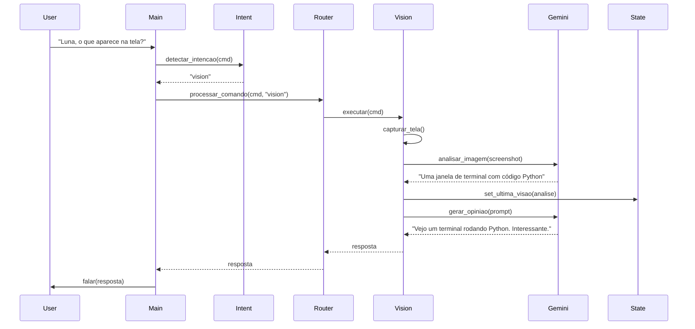
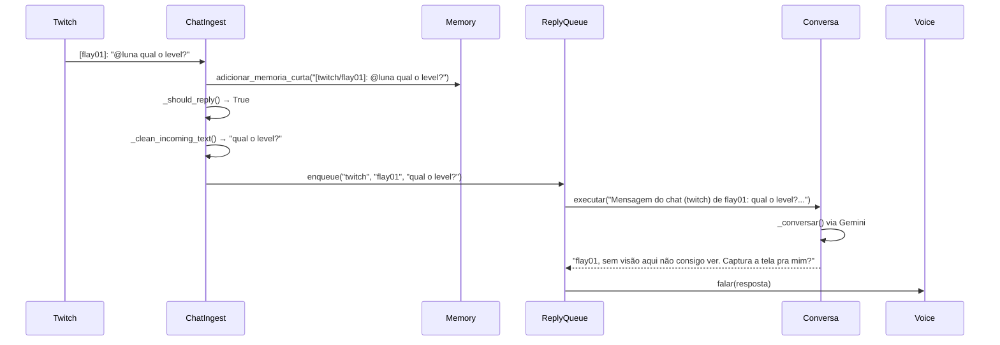

# 🤖 AGENTS.md - Sistema de Agentes da Luna

## 📋 Índice
- [Visão Geral](#visão-geral)
- [Arquitetura do Sistema](#arquitetura-do-sistema)
- [Componentes Principais](#componentes-principais)
- [Skills (Agentes Especializados)](#skills-agentes-especializados)
- [Fluxo de Processamento](#fluxo-de-processamento)
- [Integrações Externas](#integrações-externas)
- [Sistema de Memória](#sistema-de-memória)
- [Configuração e Personalização](#configuração-e-personalização)

---

## 🎯 Visão Geral

**Luna** é uma assistente virtual brasileira multi-agente com capacidades de VTuber, projetada para interação por voz, processamento de comandos e automação de tarefas. O sistema utiliza uma arquitetura modular baseada em skills (agentes especializados) que se comunicam através de um roteador central.

### Características Principais
- ✅ **Arquitetura Multi-Agente**: Skills especializadas e independentes
- 🎙️ **Interface de Voz**: STT (Groq Whisper) e TTS (Murf.ai/pyttsx3)
- 🧠 **IA Conversacional**: Google Gemini para diálogos naturais
- 👁️ **Visão Computacional**: Análise de tela com Gemini Vision
- 🎮 **Automação**: Macros de teclado/mouse
- 💬 **Chat Streaming**: Integração com Twitch/YouTube
- 🌐 **Web Scraping**: Leitura de sites e resumo de conteúdo
- 📊 **Painel em Tempo Real**: WebSocket para monitoramento

---

## 🏗️ Arquitetura do Sistema

### Diagrama de Componentes

```
┌─────────────────────────────────────────────────────────────────┐
│                        MAIN.PY (Orquestrador)                     │
│  ┌─────────────┐  ┌──────────────┐  ┌─────────────────────┐    │
│  │ Voice Input │  │ Menu Radial  │  │ Realtime Panel      │    │
│  │   (STT)     │  │   (Eel UI)   │  │  (SocketIO/Flask)   │    │
│  └──────┬──────┘  └──────┬───────┘  └──────────┬──────────┘    │
│         │                │                      │                │
│         └────────────────┴──────────────────────┘                │
│                          │                                        │
└──────────────────────────┼────────────────────────────────────────┘
                           │
                           ▼
┌─────────────────────────────────────────────────────────────────┐
│                    INTENT.PY (Classificador)                      │
│  • Detecção de intenção por keywords                             │
│  • Sem dependência de API externa                                │
│  • ~20 categorias de intenção                                    │
└──────────────────────────┬────────────────────────────────────────┘
                           │
                           ▼
┌─────────────────────────────────────────────────────────────────┐
│                     ROUTER.PY (Dispatcher)                        │
│  • Lazy-loading de skills                                        │
│  • Matching por intent/gatilhos/nome                             │
│  • Hot-reload de módulos                                         │
└──────────────────────────┬────────────────────────────────────────┘
                           │
           ┌───────────────┼───────────────┐
           │               │               │
           ▼               ▼               ▼
     ┌─────────┐    ┌──────────┐    ┌─────────┐
     │ Conversa│    │  Vision  │    │   TTS   │
     │ (Gemini)│    │ (Gemini) │    │  (Murf) │
     └─────────┘    └──────────┘    └─────────┘
           │               │               │
           ▼               ▼               ▼
     ┌─────────┐    ┌──────────┐    ┌─────────┐
     │WebReader│    │YouTubeSm.│    │  Price  │
     │(Playwrig│    │(yt-dlp)  │    │ (CMC)   │
     └─────────┘    └──────────┘    └─────────┘
           │               │               │
           ▼               ▼               ▼
     ┌─────────┐    ┌──────────┐    ┌─────────┐
     │Sequencia│    │  System  │    │  Chat   │
     │ Manager │    │ Monitor  │    │ Ingest  │
     └─────────┘    └──────────┘    └─────────┘
```

### Estado Global (STATE)

O módulo `state.py` gerencia o estado compartilhado entre todos os agentes:

```python
class StateManager:
    # Sequências
    gravando_sequencia: bool
    esperando_nome_sequencia: bool
    esperando_loops: bool
    sequencia_pendente: str | None
    
    # Conversa
    em_conversa_ativa: bool
    historico: list[dict]
    ultima_skill_usada: str | None
    
    # Visão
    ultima_visao: str | None
    ultima_visao_ts: str | None
    ultima_captura_path: str | None
    ultima_captura_hash: str | None
    
    # Ativação
    modo_ativacao: str  # "assistente" ou "vtuber"
```

---

## 🧩 Componentes Principais

### 1. **Main.py** - Orquestrador
- **Responsabilidade**: Loop principal, coordenação de componentes
- **Funcionalidades**:
  - Inicialização de subsistemas (painel, menu, chat ingest)
  - Captura de entrada (voz ou menu radial)
  - Roteamento de comandos
  - Gestão de shutdown

```python
# Ciclo principal
while True:
    cmd = ouvir()  # STT
    if not cmd:
        cmd = capturar_do_menu()  # Fallback para menu radial
    
    intent = detectar_intencao(cmd)
    resposta = processar_comando(cmd, intent)
    
    if resposta:
        falar(resposta)  # TTS
```

### 2. **Intent.py** - Classificador de Intenção
- **Método**: Regex + keyword matching
- **Sem API**: Não depende de modelos externos
- **Estratégia**:
  1. Normalização Unicode
  2. Matching de frases completas
  3. Matching de palavras-chave
  4. Priorização por estados (sequência, visão)

**Exemplo de Classificação**:
```python
def detectar_intencao(cmd: str) -> str:
    cmd_norm = _normalizar_texto(cmd.lower())
    
    # Estado tem prioridade
    if STATE.esperando_nome_sequencia:
        return "sequencia"
    
    # Visão
    if _eh_pergunta_visual(cmd_norm):
        return "vision"
    
    # Preço
    if _tem_palavra(cmd_norm, ["preco", "bitcoin", "dolar"]):
        return "price"
    
    # Conversa (fallback)
    return "conversa"
```

### 3. **Router.py** - Dispatcher de Skills
- **Lazy Loading**: Skills carregadas sob demanda
- **Hot Reload**: Suporta recarga sem reiniciar
- **Triple Match**: Intent → Nome → Gatilhos

```python
class RouterLuna:
    def processar_comando(cmd, intent):
        # 1. Match por nome de skill
        for nome in skill_modulos:
            if intent in nome:
                return skill.executar(cmd)
        
        # 2. Match por lista de intents
        for skill in skills:
            if intent in skill.SKILL_INFO["intents"]:
                return skill.executar(cmd)
        
        # 3. Match por gatilhos (keywords)
        for skill in skills:
            if any(g in cmd for g in skill.GATILHOS):
                return skill.executar(cmd)
```

### 4. **Memory.py** - Sistema de Memória
- **Dois Níveis**:
  - **Memória de Curto Prazo**: JSON volátil (últimas 50 interações)
  - **Memória de Longo Prazo**: JSON persistente (histórico completo)
- **Busca Semântica**: Tokenização + scoring por palavras-chave
- **Auto-trimming**: Limita tamanho automaticamente

### 5. **Voice.py** - Sistema de Voz

#### STT (Speech-to-Text)
- **Engine Primário**: Groq Whisper (`whisper-large-v3`)
- **Fallback**: Google Speech Recognition
- **VAD**: WebRTC VAD para filtrar ruído
- **Parâmetros**:
  - RMS mínimo adaptativo
  - Duração mínima de fala
  - Detecção de energia dinâmica

#### TTS (Text-to-Speech)
- **Engine Primário**: Murf.ai (voz `pt-BR-isadora`)
- **Fallback**: pyttsx3
- **Modo Assíncrono**: Fila com worker thread
- **Streaming**: MP3 via ffplay (baixa latência)
- **OBS Integration**: Atualização de text source

---

## 🤖 Skills (Agentes Especializados)

Cada skill é um agente independente com interface padronizada:

```python
SKILL_INFO = {
    "nome": str,
    "descricao": str,
    "versao": str,
    "autor": str,
    "intents": list[str],
}

GATILHOS = ["palavra1", "palavra2", ...]

def inicializar(): ...
def executar(comando: str) -> str: ...
```

### 📊 Tabela de Skills

| Skill | Intents | Modelo/API | Função |
|-------|---------|------------|--------|
| **conversa.py** | `conversa`, `chat` | Gemini 3 Flash | Diálogo natural com personalidade |
| **vision.py** | `visao`, `vision` | Gemini Vision | Análise de tela/imagem |
| **web_reader.py** | `web_reader` | Gemini Vision + Playwright | Leitura de sites |
| **youtube_summary.py** | `youtube_summary` | Groq + yt-dlp | Resumo de vídeos |
| **price.py** | `preco`, `price` | CoinMarketCap API | Preço de criptomoedas |
| **tts_murf.py** | `tts`, `narrar` | Murf.ai | Narração de texto/arquivo |
| **sequencia_manager.py** | `sequencia_manager` | pynput + pyautogui | Gravação/execução de macros |
| **system_monitor.py** | `system_monitor` | psutil | Monitoramento de CPU/RAM |
| **chat_ingest.py** | N/A (background) | Twitch IRC + YouTube API | Ingestão de chat ao vivo |

---

## 🔄 Fluxo de Processamento

### Exemplo: Comando de Visão



### Exemplo: Chat Ingest → Resposta Automática



---

## 🌐 Integrações Externas

### 1. **Google Gemini**
- **Modelos**:
  - `gemini-3-flash-preview` (conversa)
  - `gemini-3-flash-preview` (vision)
- **Rotação de Chaves**: Até 3 API keys configuráveis
- **Fallback**: Groq (Llama 3.1) para opinião de visão

### 2. **Groq**
- **Whisper STT**: `whisper-large-v3`
- **Chat Completion**: `llama-3.1-8b-instant`
- **Uso**: Backup quando Gemini falha ou para resumos

### 3. **Murf.ai**
- **Voz**: `pt-BR-isadora` (configurável)
- **Streaming**: MP3 via endpoint `/v1/speech/stream`
- **Parâmetros**:
  - Rate: 15 (velocidade)
  - Pitch: 10 (tom)
  - Style: Conversational
  - Model: FALCON

### 4. **CoinMarketCap**
- **Endpoint**: `/v1/cryptocurrency/quotes/latest`
- **Busca**: Por símbolo ou nome
- **Ranking**: Prioriza moedas por rank global

### 5. **Twitch IRC**
- **Servidor**: `irc.chat.twitch.tv:6667`
- **Autenticação**: OAuth token
- **PRIVMSG**: Parsing manual de mensagens

### 6. **YouTube Live Chat**
- **API**: `youtube/v3/liveChat/messages`
- **Polling**: 5s (configurável)
- **PageToken**: Mantém estado entre requests

### 7. **Playwright**
- **Navegador**: Chromium headless
- **Screenshot**: Full-page ou viewport
- **User-Agent**: Customizado para evitar detecção

### 8. **OBS WebSocket**
- **Lib**: `obsws-python`
- **Ações**:
  - `set_input_settings`: Atualizar text source
  - `set_scene_item_enabled`: Toggle de visibilidade
- **Auto-clear**: Timer para limpar texto após N segundos

---

## 🧠 Sistema de Memória

### Arquitetura de Memória

```
memory/
├── short_term.json      # Últimas 50 interações (volátil)
├── long_term.json       # Histórico completo (persistente)
└── chat_history.json    # Conversa estruturada (UI)
```

### Formato de Dados

```json
{
  "items": [
    {
      "timestamp": "2026-02-10T14:35:22.123456",
      "origem": "usuario",
      "texto": "Lembre que meu aniversário é em março"
    },
    {
      "timestamp": "2026-02-10T14:36:10.987654",
      "origem": "chat_twitch",
      "texto": "[twitch/flay01]: qual o level?"
    }
  ],
  "meta": {
    "created_at": "2026-01-01T00:00:00",
    "updated_at": "2026-02-10T14:36:10",
    "version": 1
  }
}
```

### Sistema de Busca

```python
def buscar_memorias(consulta: str, limit=3) -> list[dict]:
    """
    Busca por score de tokens:
    1. Tokeniza consulta (palavras ≥3 chars)
    2. Score = count de tokens presentes em cada memória
    3. Ordena por score decrescente
    4. Retorna top N
    """
```

### Injeção de Contexto

O módulo `prompt_injector.py` gerencia a construção de prompts com memória:

```python
def build_prompt(
    base: str,
    sections: Iterable[PromptSection],
    joiner: str = "\n\n",
    max_chars: int | None = None,
) -> str:
    """
    Monta prompt com priorização:
    - PromptSection(text, priority, label)
    - Ordena por priority (maior = mais importante)
    - Trunca se max_chars definido
    """
```

**Ordem de Injeção** (`LUNA_PROMPT_ORDER`):
- `inject_then_trim`: Contexto → Visão → Última resposta → Truncar
- `trim_then_inject`: Truncar → Contexto → Visão → Última resposta

---

## ⚙️ Configuração e Personalização

### Variáveis de Ambiente Principais

#### TTS/STT
```env
LUNA_TTS_ENGINE=murf                    # pyttsx3 | murf
LUNA_STT_ENGINE=groq                    # groq | google
MURF_API_KEY=your_key
GROQ_API_KEY=your_key
LUNA_MURF_VOICE=pt-BR-isadora
LUNA_TTS_ASYNC=1                        # Fila assíncrona
LUNA_TTS_QUEUE_MAX=5
```

#### Gemini
```env
GEMINI_API_KEY=your_key_1
GEMINI_API_KEY_2=your_key_2             # Rotação automática
GEMINI_API_KEY_3=your_key_3
LUNA_GEMINI_MODEL=gemini-3-flash-preview
LUNA_PROMPT_ORDER=inject_then_trim
LUNA_MEM_LENGTH=2                       # Histórico no contexto
```

#### Chat Streaming
```env
LUNA_TWITCH_ENABLED=1
LUNA_TWITCH_NICK=your_bot_nick
LUNA_TWITCH_OAUTH=oauth:your_token
LUNA_TWITCH_CHANNEL=your_channel

LUNA_CHAT_REPLY_ENABLED=1
LUNA_CHAT_REPLY_MODE=all                # all | mention | prefix
LUNA_CHAT_REPLY_MIN_INTERVAL=8          # Segundos entre respostas
LUNA_CHAT_REPLY_USER_COOLDOWN=30        # Cooldown por usuário
```

#### OBS
```env
LUNA_OBS_ENABLED=1
LUNA_OBS_HOST=127.0.0.1
LUNA_OBS_PORT=4455
LUNA_OBS_PASSWORD=your_password
LUNA_OBS_TEXT_SOURCE=Luna_Text           # Nome da fonte de texto
LUNA_OBS_CLEAR_SEC=5                     # Auto-clear após N segundos
LUNA_OBS_WRAP_CHARS=80                   # Word wrap
```

#### Visão
```env
LUNA_VISION_AUTO_SEC=6                   # Intervalo do modo automático
```

### Modos de Ativação

```python
# Modo Assistente: Requer "Luna" no comando
STATE.set_modo_ativacao("assistente")

# Modo VTuber: Sempre ativo, responde sem prefixo
STATE.set_modo_ativacao("vtuber")
```

**Comandos de Modo**:
- `"Luna, ativar modo vtuber"` → VTuber mode
- `"Luna, ativar modo assistente"` → Assistente mode

### Personalização de Personalidade

#### Via `system_message.yaml`:
```yaml
presets:
  default:
    system_prompt: |
      Você é a Luna, VTuber e assistente IA brasileira.
      Personalidade: sarcástica, divertida, irônica.
      Tom: natural, sem formalidade excessiva.
      Respostas: 2-4 frases completas, diretas.
      Evitar: listas, asteriscos, hashtags.
```

#### Via `system_message.txt` (fallback):
```
Você é a Luna, assistente virtual brasileira.
Responda em português brasileiro, com tom natural e direto.
Use 2 a 4 frases completas, sem listas, sem asteriscos ou hashtags.
```

### Hot Reload de Skills

```python
# Via comando de voz
"Luna, recarregar skills"

# Via painel realtime
{
  "action": "recarregar_skills",
  "payload": {}
}
```

---

## 🎛️ Painel em Tempo Real

Acesse `http://127.0.0.1:5055` (configurável):

### Funcionalidades
- ✅ **Monitoramento**: Status de conexão, modo, engines
- ✅ **Controle de Modo**: Alternar assistente/vtuber
- ✅ **Memória**: Limpar memória de curto prazo
- ✅ **Comandos**: Executar comandos via interface web
- ✅ **Hot Reload**: Recarregar skills sem reiniciar

### WebSocket Events

```javascript
// Cliente → Servidor
socket.emit("control", {
  action: "set_mode",
  payload: { modo: "vtuber" }
});

socket.emit("control", {
  action: "comando",
  payload: { 
    comando: "qual o preço do bitcoin?",
    falar: true  // Luna falará a resposta
  }
});

// Servidor → Cliente
socket.on("state_update", (state) => {
  console.log(state.modo);           // "vtuber" | "assistente"
  console.log(state.ultimo_comando); // Último comando processado
  console.log(state.tts_engine);     // "murf" | "pyttsx3"
});
```

---

## 🔐 Segurança

### Autenticação
```env
LUNA_PANEL_TOKEN=seu_token_secreto
```
Query param obrigatório: `?token=seu_token_secreto`

### Rate Limiting
- Chat reply: Interval mínimo entre respostas
- User cooldown: Cooldown por usuário
- Queue max: Limite de mensagens na fila

---

## 🐛 Debug e Logging

### Níveis de Log
```python
import logging
logging.basicConfig(level=logging.INFO)  # INFO | DEBUG | WARNING
```

### TTS Debug Timer
```env
LUNA_TTS_DEBUG_TIMER=1  # Mostra tempo de cada etapa do TTS
```

Output:
```
[TTS DEBUG] murf_resposta: 0.234s
[TTS DEBUG] inicio_fala_murf: 0.456s
[TTS DEBUG] murf_total: 2.134s
```

---

## 📈 Métricas e Monitoramento

### Estado Global Exposto
```python
{
  "ts": "2026-02-10 14:35:22",
  "modo": "vtuber",
  "ultima_visao": "Tela de jogo com personagem...",
  "ultima_resposta_curta": "Primeira resposta...",
  "ultimo_comando": "o que aparece na tela?",
  "ultima_intencao": "vision",
  "status": "Processando comando...",
  "historico_len": 15,
  "memoria_curta_len": 32,
  "tts_engine": "murf",
  "tts_async": true,
  "tts_queue_max": 5,
  "stt_engine": "groq"
}
```

---

## 🚀 Fluxo de Adição de Nova Skill

### 1. Criar arquivo `skills/minha_skill.py`

```python
SKILL_INFO = {
    "nome": "Minha Skill",
    "descricao": "Faz algo incrível",
    "versao": "1.0.0",
    "autor": "Seu Nome",
    "intents": ["minha_skill", "outra_intent"],
}

GATILHOS = ["palavra1", "palavra2", "frase chave"]

def inicializar():
    print(f"✅ {SKILL_INFO['nome']} inicializada")

def executar(comando: str) -> str:
    # Sua lógica aqui
    return "Resposta da skill"
```

### 2. (Opcional) Adicionar intent em `intent.py`

```python
def detectar_intencao(cmd: str) -> str:
    # ...
    if _tem_palavra(cmd_norm, ["minha", "palavra"]):
        return "minha_skill"
```

### 3. Recarregar via comando

```bash
"Luna, recarregar skills"
```

### 4. Testar

```bash
"Luna, palavra1 palavra2"
```

---

## 📚 Recursos Adicionais

### Dependências Principais
- `google-generativeai`: Gemini API
- `groq`: Whisper STT + Llama chat
- `pyttsx3`: TTS fallback
- `speech_recognition`: STT base
- `playwright`: Web scraping
- `obsws-python`: OBS integration
- `flask-socketio`: Realtime panel
- `pynput` + `pyautogui`: Automação

### Estrutura de Diretórios
```
luna/
├── core/                    # Componentes principais
│   ├── voice.py
│   ├── intent.py
│   ├── router.py
│   ├── memory.py
│   ├── chat_ingest.py
│   ├── realtime_panel.py
│   ├── obs_client.py
│   └── prompt_injector.py
├── skills/                  # Agentes especializados
│   ├── conversa.py
│   ├── vision.py
│   ├── web_reader.py
│   ├── youtube_summary.py
│   ├── price.py
│   ├── tts_murf.py
│   ├── sequencia_manager.py
│   └── system_monitor.py
├── config/                  # Configuração
│   ├── state.py
│   ├── env.py
│   ├── assistant_config.py
│   └── assistant_config.yaml
├── interface/               # UI
│   └── radial_menu_eel.py
├── memory/                  # Dados de memória
│   ├── short_term.json
│   ├── long_term.json
│   └── chat_history.json
├── data/                    # Dados temporários
│   ├── macros.json
│   └── capturas/
├── main.py                  # Entrypoint
└── .env                     # Variáveis de ambiente
```

---

## 🎓 Conceitos Avançados

### Prompt Injection com Priorização

```python
sections = [
    PromptSection(contexto, priority=10, label="contexto"),
    PromptSection(visao, priority=30, label="visao"),
    PromptSection(memoria, priority=20, label="memoria"),
]
prompt = build_prompt(base, sections, max_chars=4000)
```

### Reforço de Resposta

Sistema de duas passadas para evitar respostas curtas/incompletas:

```python
resposta = gerar_opiniao(prompt)
if _precisa_reforco(resposta):
    reforco = "INSTRUÇÃO CRÍTICA: responda com mais detalhes..."
    resposta = gerar_opiniao(prompt + "\n\n" + reforco)
```

### VAD (Voice Activity Detection)

Filtro WebRTC para reduzir falsos positivos:

```python
def _vad_rejeitar_audio(audio: sr.AudioData) -> bool:
    vad = webrtcvad.Vad(mode=2)  # 0-3, 3 = mais agressivo
    frames_with_speech = 0
    for frame in split_audio(audio):
        if vad.is_speech(frame):
            frames_with_speech += 1
    return frames_with_speech < MIN_SPEECH_FRAMES
```

### Chat Reply Queue Pattern

Sistema de fila com worker thread para evitar bloqueio:

```python
_reply_queue: Queue[tuple[str, str, str]] = Queue(maxsize=20)

def _reply_worker():
    while True:
        platform, user, text = _reply_queue.get()
        resposta = gerar_resposta(platform, user, text)
        falar(resposta)
        _reply_queue.task_done()

threading.Thread(target=_reply_worker, daemon=True).start()
```

---

## 🤝 Contribuindo

### Checklist para Nova Skill

- [ ] Implementar `SKILL_INFO`, `GATILHOS`, `inicializar()`, `executar()`
- [ ] Adicionar testes básicos
- [ ] Documentar parâmetros de ambiente necessários
- [ ] Atualizar `AGENTS.md` com entrada na tabela de skills
- [ ] Considerar fallbacks para APIs externas
- [ ] Implementar tratamento de erros robusto
- [ ] Validar resposta antes de retornar (evitar None/vazio)

---

## 📝 Changelog

### v1.1.0 (2026-02-10)
- ✅ Sistema de chat ingest (Twitch/YouTube)
- ✅ Painel realtime com WebSocket
- ✅ Modo automático de visão
- ✅ TTS assíncrono com fila
- ✅ Rotação de chaves Gemini

### v1.0.0 (2026-01-01)
- 🎉 Release inicial
- ✅ Skills: conversa, vision, web, youtube, price
- ✅ STT/TTS com Groq e Murf
- ✅ Sistema de memória dual

---

**Luna v1.1.0** | Criado com 💜 por Luna Team
